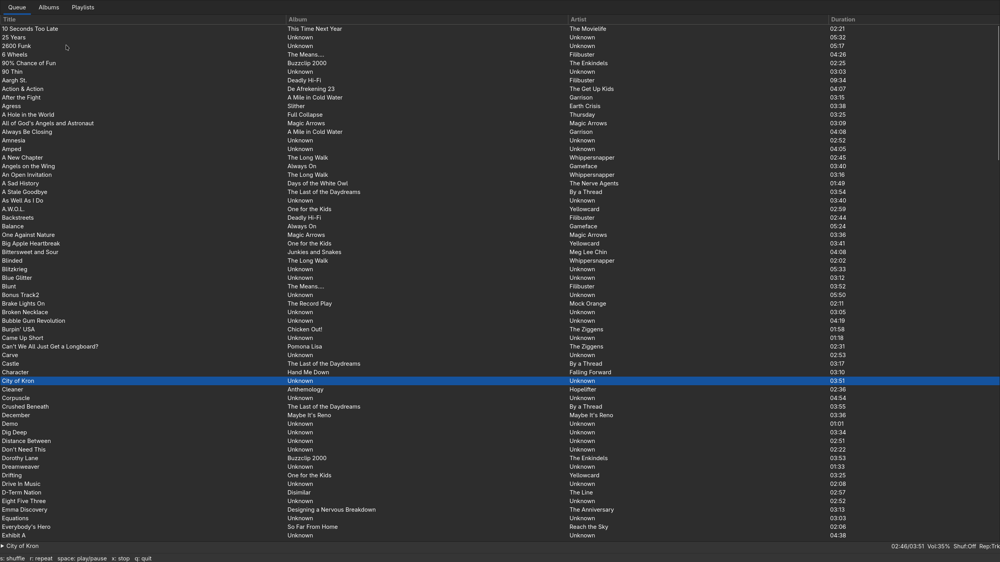

# Koji Music Player

Koji is a music player built with C++ and the ImGui library. 
It uses mpv for audio playback and SDL3 for window management. 

## Overview

- **Song Queue Tab**: Displays the current song queue and allows users to select songs to play.
- **Album Selection Tab**: Lists available albums and allows users to add all songs from an album to the queue.
- **Playlist Selection Tab**: Lists available playlists and allows users to add all songs from a playlist to the queue.

## Quick Start

### For Linux

- **Dependencies:** [gtkmm](https://gtkmm.gnome.org/en/download.html), [mpv](https://mpv.io/), [taglib](https://taglib.org/) (Install these dependencies using your system's package manager before building)
- **Installation:** ```git clone https://github.com/Wraitheend/koji.git && make all```
- **Importing Files:** Follow the formatting in [File Formatting](#file-formatting)
- **Running:** ```./koji```

### For Others

-  Create a feature request sorry but i ain't freely supporting other systems than linux unless people want it.

## Keybinding
- `Esc`: Quits the program
- `S`: Toggle shuffle
- `R`: Toggle repeat mode
- `X`: Stop music
- `Space Bar`: Toggle pause
- `+`: Increase volume by 5%
- `-`: Decrease volume by 5%
- `Tab`: Cycle tabs
- `Right-Click`: Opens context popup when over an entry

## Features

### Shuffling 

In shuffle mode the song queue is randomly ordered. 
Any new albums or playlists added will be shuffled and appended to the queue.

### Repeat Mode 

There are three states: `Off`, `All`, and `Track`. 
`Off` will stop repeating after the current queue is finished. 
`All` will repeat the entire queue when the last song is reached. 
`Track` will repeat the current song forever.

### Queue Management

Songs can be added to the queue by selecting albums and playlists in the respective tabs. 
Shift clicking appends. 
Regular clicking replaces.

## File Formatting

Koji requires the following file formats for songs and playlists:

### Albums

Albums should be stored in the following directory structure: `~/.config/koji/albums/<artist>/<album>/<title>.<ext>`. As an example: `~/.config/koji/albums/Grimes/Visions/Infinite Love without Fulfilment.mp3`  

**Optional Metadata:**

For each song file in the album to sort and display them appropriately they should have the following ID3 metadata tags:

- **track**: The tracks number.
- **title**: The songs title.
- **artist**: The artists name.

### Playlists

Playlists should be stored as `.m3u` files in the directory structure: `~/.config/koji/playlists/<playlist-name>/<playlist-title>.m3u`

Each line in the playlist file should contain the path to a song ideally in the directory `~/.config/koji/playlists/<playlist-name>/` with the following format of: `<title>.<ext>`
Otherwise you can use direct paths to files in albums or elsewhere.

For each song file in the playlist to display them appropriately they should have the following ID3 metadata tags:

- **title**: The songs title.
- **album**: The albums name.
- **artist**: The artists name.

## Screenshots




**[DISCLAIMER](docs/DISCLAIMER.md)**
